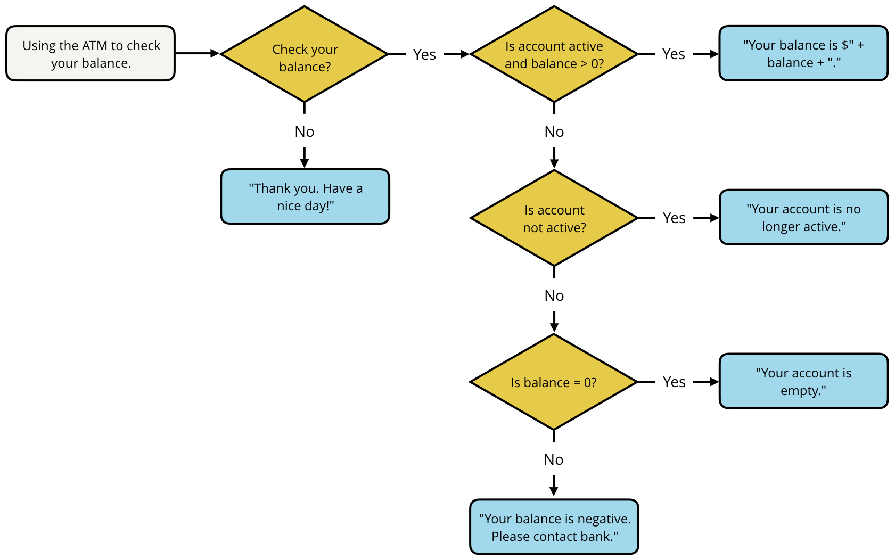

# Intro to JavaScript
A complete overview of UDACITY's Intro to JavaScript course

## Table of Contents
1. [What is JavaScript?](#what-is-javascript)
   1. [Introduction to JavaScript](#introduction-to-javascript)
   2. [History of JavaScript](#history-of-javascript)
   3. [The JavaScript Console](#the-javascript-console)
   4. [Developer Tools on Different Browsers](#developer-tools-on-different-browsers)
   5. [Console Log](#console-log)
   6. [JavaScript Demo](#javascript-demo)
   7. [Lesson 1 Summary](#lesson-1-summary)
2. [Data Types and Variables](#data-types-and-variables)
   1. [Introduction to Data Types](#introduction-to-data-types)
   2. [Numbers](#numbers)
   3. [Comments](#comments)
   4. [Quiz: First Expression (2-1)](#quiz-first-expression-2-1)
   5. [Strings](#strings)
   6. [String Concatination](#string-concatination)
   7. [Variables](#variables)
   8. [Quiz: Converting Temperatures (2-2)](#quiz-converting-temperatures-2-2)
   9. [String Index](#string-index)
   10. [Escaping Strings](#escaping-strings)
   11. [Comparing Strings](#comparing-strings)
   12. [Quiz: Favorite Food (2-3)](#quiz-favorite-food-2-3)
   13. [Quiz: String Equality for All (2-4)](#quiz-string-equality-for-all-2-4)
   14. [Quiz: All Tied Up (2-5)](#quiz-all-tied-up-2-5)
   15. [Quiz: Josa Buson (2-6)](#quiz-josa-buson-2-6)
   16. [Booleans](#booleans)
   17. [Quiz: Facebook Post (2-7)](#quiz-facebook-post)
   18. [Null, Undefined and NaN](#null-undefined-and-nan)
   19. [Equality](#equality)
   20. [Quiz: Semicolons!(2-8)](#quiz-semicolons-2-8)
   21. [Quiz: What's My Name?(2-9)](#quiz-whats-my-name-2-9)
   22. [Quiz: Out to Dinner (2-10)](#quiz-out-to-dinner-2-10)
   23. [Quiz: Mad Libs (2-11)](#quiz-mad-libs-2-11)
   24. [Quiz: One Awesome Message (2-12)](#quiz-one-awesome-message-2-12)
   25. [Lesson 2 Summary](#lesson-2-summary)
3. [Conditionals](#conditionals)
   1. [Intro to Conditionals](#intro-to-conditionals)
   2. [Quiz: Flowcharts (3-1)](#quiz-flowcharts-3-1)
   3. [Flowchart to Code](#flowchart-to-code)
   4. [If...Else Statements](#if-else-statements)
   5. [Else If Statements](#else-if-statements)
   6. [Quiz: Even or Odd (3-2)](#quiz-even-or-odd-3-2)
   7. [Quiz: Musical Groups (3-3)](#quiz-musical-groups-3-3)
   8. [Quiz: Murder Mystery (3-4)](#quiz-murder-mystery-3-4)
   9. [More Complex Problems](#more-complex-problems)
   10. [Logical Operators](#logical-operators)
   11. [Logical AND and OR](#logical-and-and-or)
   12. [Quiz: Checking your Balance (3-5)](#quiz-checking-your-balance-3-5)
   13. [Quiz: Ice Cream (3-6)](#quiz-ice-cream-3-6)
   14. [Quiz: What do I Wear? (3-7)](#quiz-what-do-i-wear-3-7)
   15. [Advanced Conditionals](#advanced-conditionals)
   16. [Truthy and Falsy](#truthy-and-falsy)
   17. [Ternary Operator](#ternary-operator)
   18. [Quiz: Navigating the Food Chain (3-8)](#quiz-navigating-the-food-chain-3-8)
   19. [Switch Statement](#switch-statement)
   20. [Falling-through](#falling-through)
   21. [Quiz: Back to School (3-9)](#quiz-back-to-school-3-9)
   22. [Lesson 3 Summary](#lesson-3-summary)
4. [Loops](#loops)
   1. [Intro to Loops](#intro-to-loops)
   2. [While Loops](#while-loops)
   3. [Parts of a While Loop](#parts-of-a-while-loop)
   4. [Quiz: JuliaJames (4-1)](#quiz-juliajames-4-1)
   5. [Quiz: 99 Bottles of Juice (4-2)](#quiz-99-bottles-of-juice-4-2)
   6. [Quiz: Countdown, Liftoff! (4-3)](#quiz-countdown-liftoff-4-3)
   7. [For Loops](#for-loops)
   8. [Parts of a For Loop](#parts-of-a-for-loop)
   9. [Nested Loops](#nested-loops)
   10. [Increment and Decrement](#increment-and-decrement)
   11. [Quiz: Changing the Loop (4-4)](#quiz-changing-the-loop-4-4)
   12. [Quiz: Fix the Error 1 (4-5)](#quiz-fix-the-error-1-4-5)
   13. [Quiz: Fix the Error 2 (4-6)](#quiz-fix-the-error-2-4-6)
   14. [Quiz: Factorials! (4-7)](#quiz-factorials-4-7)
   15. [Quiz: Find my Seat (4-8)](#quiz-find-my-seat-4-8)
   16. [Lesson 4 Summary](#lesson-4-summary)
5. [Functions](#functions)
6. [Arrays](#arrays)
7. [Objects](#objects)

## What is JavaScript?
### Introduction to JavaScript
- JavaScript is a programming language for the web
- It is the the final piece needed to make your websites come to life
- It was created to make it easier to add interactive and dynamic elements to websites
- It can also be used to program a robot, write a game script or build a code editor
- It has grown to be one of the most popular languages in the world

### History of JavaScript
- JavaScript was created in just 10 days by Brendan Eich back in 1995
- Prior to JavaScript, websites just existed as pages of HTML and CSS with the occasional plug-in or Java applet
- It was originally called LiveScript, but was changed to JavaScript due to Java's popularity at the time
- Due to competing versions emerging, JavaScript was taken to Ecma International to be standardized
- Recent versions can also be referenced by their ECMAScript version number, such as, ES5 or ES6
- Even more recently, it uses a year-based number to promote a more consistent release cycle with ES2016, ES2017, etc.

### The JavaScript Console using Google Chrome

In Google Chrome, you can access the console by opening the developer tools, which can be done by right clicking the page and selecting inspect. Once open, navigate to the console tab. Alternatively, the keyboard shortcut is Cmd+Option+J on a Mac or Ctrl+Shift+J on Windows. For more Chrome developer tools keyboard shortcuts [click here](https://developers.google.com/web/tools/chrome-devtools/shortcuts).

You can write and test JavaScript code directly in the console. For example, to write your first line of code you could start by writing your name. As you see, just writing your name will actually result in an error. To be able to actually write your name in JavaScript without an error you need to format your name as a data type called a string put inside quotes:
```js 
"Michael"
```
Why don’t we try something else? Here’s some code that creates an alert that says, Hello, Julia, how are you? And it pushes it to the browser:
```js
alert("Hello, Michael! How are you?!");
```
Now writing code directly in your browser is something you can do to test out new code snippets where you’re not really sure what they do. But it could actually get pretty annoying once you start writing larger and larger programs. For example, if you wanted to create more than just one alert, it may seem simple at first, but each time you need to go to the next line, you would have to type Shift+Return instead of just the Return key.
```js
alert("Hello");
alert(":(");
```
```js
alert("Hello");
alert("This is great!");
alert("JavaScript is fun!");
```
This is going to get pretty annoying pretty fast. Eventually, you’ll learn about other ways to run JavaScript files. But for now we recommend using a text editor like Atom or Sublime Text and then pasting your code in the console once you’re ready to test it.

### Developer Tools on Different Browsers
Every modern web browser includes its own set of developer tools. Developer tools allow you to debug and test out your ideas directly in the browser. If you're familiar with HTML or CSS, you may have used them to experiment with the style of a webpage, however, you can also use them with JavaScript. They are often used as a sandbox, that is, a place to mess around with any code without any long-term consequences. You can use them to debug problems you run in to or to test a piece of code. If you open any website that uses JavaScript, the console will tell you if there are any warnings or errors on the page and will also display any output and print it with console.log. Warnings and errors are very common when visiting sites and will not affect your code.

DevTools can be separated into three categories; independent, Mac and Windows. Independent browsers, such as, Google Chrome, Mozilla Firefox and Opera can be used regardless of operating system. Specific browsers, such as, Safari, Internet Explorer and Microsoft Edge Mac are dependent on their respective Mac or Windows operating system. Below is a guide to the various web browsers and their respective developer tools:

- [Independent](#independent)
- [Mac](#mac)
- [Windows](#windows)
- [Further Reading](#further-reading)

#### Independent
With most independent browsers, such as, Google Chrome, Mozilla Firefox and Opera, you can access them with a right-click on an element and then selecting Inspect Element. Alternatively, you can use the following shortcuts:
- Command + Option + i (Mac)
- Ctrl + Shift + i (Windows/Linux).

#### Mac
Safari has the same options to access it's DevTools as with independent browsers, however, you first have to enable the Develop menu in Safari’s Advanced preferences in order to use them.

#### Windows
Internet Explorer and Microsoft Edge have the F12 DevTools, which are accessible by simply pressing F12 on the Keyboard. Testing for Internet Explorer 8, 9, 10 and 11 is arguably still best practice for web based projects, because they often present unique problems. Apparently, due to Microsoft Edge's tools having been written in TypeScript, it is always running and no reload is required. In addition, F12 developer tools documentation is now fully available on [GitHub](https://github.com/MicrosoftDocs/edge-developer).

#### Further Reading
- [Google Chrome](https://developers.google.com/web/tools/chrome-devtools/)
- [Mozilla Firefox](https://developer.mozilla.org/en-US/docs/Tools)
- [Opera](https://www.opera.com/dragonfly/)
- [Safari](https://developer.apple.com/safari/tools/)
- [Internet Explorer 8](https://msdn.microsoft.com/en-us/library/dd565628.aspx)
- [Internet Explorer 9](https://docs.microsoft.com/en-us/previous-versions/windows/internet-explorer/ie-developer/samples/gg589512(v=vs.85))
- [Internet Explorer 10](https://docs.microsoft.com/en-us/previous-versions/windows/internet-explorer/ie-developer/dev-guides/hh673549(v=vs.85))
- [Internet Explorer 11](https://docs.microsoft.com/en-us/previous-versions/windows/internet-explorer/ie-developer/dev-guides/bg182636(v=vs.85))
- [Microsoft Edge](https://docs.microsoft.com/de-de/microsoft-edge/devtools-guide)

### Console Log
console.log is used to print content to the JavaScript console:
```js
console.log("hiya friend!");
```
**Prints:** "hiya friend!"

The message logged is a data type called a **string** (a sequence of characters).

#### Optional demo example
Let’s use console.log to do something a little more interesting. Here’s a block of JavaScript code that loops through the numbers 0 through 9 and prints them out to the console:
```js
for (var i = 0; i < 10; i++) {
  console.log(i);
}
```
**Prints:** 0 1 2 3 4 5 6 7 8 9

This is called a **loop**.

Based on this loop's settings, any code written inside the curly brackets {...} will be repeated 10 times. In this case, console.log is printing out the value of i each time the loop runs. Don't worry if you're not sure about what the syntax means at this point. You will learn more about how and when to use loops later.

### JavaScript Demo
So you saw how to use console.log to print a message to the JavaScript console. Now, let’s see how you can use the console as a sandbox to test a new line of JavaScript in the browser.

Open [the following site](https://daringfireball.net/projects/markdown/) in a new tab and in that tab also open up developer tools. Then paste the following code:
```js
document.getElementsByTagName("h1")[0].style.color = "#ff0000";
```
As you can see, the heading changed red. Styling elements on the page is great, but you could also do that by just modifying the CSS. What makes JavaScript so special in this case? Refresh the page, then paste this line of code in the JavaScript console.
```js
document.body.addEventListener('click', function () {
     var myParent = document.getElementById("Banner"); 
     var myImage = document.createElement("img");
     myImage.src = 'https://thecatapi.com/api/images/get?format=src&type=gif';
     myParent.appendChild(myImage);
     myImage.style.marginLeft = "160px";
});
```
If you’re confused because nothing happened. Don’t worry. Click somewhere on the page. As you can see, an image was added to the page.

### Summary
Before we move on to the JavaScript language itself, how about we recap some of the things you just learned? First, you learned that all major browsers come with built-in JavaScript engines. This allows browsers to run and execute JavaScript code. Next, you got practice using the JavaScript console. The JavaScript console allows you to print strings and execute lines of JavaScript code on the fly, right inside of your browser. And finally, you wrapped up with some exercises where you use JavaScript to add styles and animations to a web page. Hopefully, you’re beginning to see the power of JavaScript. And you’re ready to dive in and explore the language.

## Data Types and Variables
### Introduction to Data Types
Data is everywhere. It’s the grade you made on your first math test, it’s the conversation you have with a loved one and it’s the decision you made to sit down and watch this video. All of these things can be represented as data. Data’s important because it helps us understand the world, recognize trends, make educated guesses and inform our future decisions. This is no different in programming. Data and data types are the building blocks of any programming language because they help us organize information and determine how our programs will run. When you look on your Facebook profile, what do you see? Your name, the number of friends you have, the date of your last post, a list of status updates and whether you liked the comment your friend just made. All this information is being gathered, calculated and presented to your friends and family visiting your profile. And when you look at your bank account, what do you see? An account number, an account balance, dates of each transaction and the name of the company that you made a purchase from. It’s important to be aware of what types of data you’re using and when it’s appropriate to use each type. In this lesson, we’ll start by learning how to define and manipulate the primitive data types of JavaScript. Numbers, strings, Booleans, undefined and null. Once you’re familiar with these data types, you’ll see how you can store data into variables so you can reuse and manipulate data throughout your code.

### Numbers
Defining a number in JavaScript is actually pretty simple. The **Number** data type includes any positive or negative integer, as well as decimals. Entering a number into the console will return it right back to you:
```js
3
```
**Returns:** 3

There, you did it.

#### Arithmetic operations
You can also perform calculations with numbers pretty easily. Basically type out an expression the way you would type it in a calculator:
```js
3 + 2.1
```
**Returns:** 5.1

Now you try!

QUESTION 1 OF 2

Enter the expressions (one at a time) into the console and determine what each expression evaluates to:

2 + 10 - 19 + 4 - 90 + 1 = -92

-20 + -19 - (-10) - (-1) + 24 = -4

(10/5) * 4 - 20 = -12

4096 % 12 = 4

#### Comparing numbers
What about comparing numbers? Can you do that? Well of course you can!

Just like in mathematics, you can compare two numbers to see if one’s greater than, less than, or equal to the other:
```js
5 > 10
```
**Returns:** false
```js
5 < 10
```
**Returns:** true
```js
5 == 10
```
**Returns:** false

Comparisons between numbers will either evaluate to true or false. Here are some more examples, so you can try it out!

| Operator | Meaning |
| :---: | :--- |
| < | Less than |
| > | Greater than |
| <= | Less than or equal to |
| >= | Greater than or equal to |
| == | Equal to |
| != | Not equal to |

QUESTION 2 OF 2

Enter the expressions (one at a time) into the console and determine what each expression evaluates to.

| Expression | Solution |
| :---: | --- |
| 43 > 47 | false |
| 12 == 17 | false |
| 3 <= 3 | true |
| 1 != 0 | true |

**TIP:** The values ```true``` and ```false``` have significant importance in JavaScript. These values are called **Booleans** and are another data type in JavaScript. Later in this lesson, you’ll learn more about why Booleans are so important in programming.

### Comments
You can use comments to help explain your code and make things clearer. In JavaScript, comments are marked with a double forward-slash //. Anything written on the same line after the // will not be executed or displayed. To have the comment span multiple lines, mark the start of your comment with a forward-slash and star, and then enclose your comment inside a star and forward-slash /* … */.
```js
// this is a single-line comment

/*
this is
a multi-line
comment
*/
```
Some of the quizzes in this course might include comments that give you hints or instructions to complete the quiz. Comments are often used to clarify and document non-obvious code. It's good practice to include code comments to improve code readability.

Alright, good luck!

### Quiz: First Expression (2-1)
#### Directions:
Write an expression that uses at least 3 different arithmetic operators.

The expression should equal 42.

**Hint:** +, -, *, /, and % are possible arithmetic operators

**Your Code:**
```js
/*
 * Programming Quiz: First Expression (2-1)
 *
 * Write an expression that uses at least three, different, arithmetic operators
 * to log the number 42 to the console.
 */

// this expression equals 4, change it to equal 42
console.log(4 * 10 + 8 - 6);
```

### Strings
Let’s take a look at the string datatype. You’ve actually used a string before, and maybe just didn’t know it. When you type a message inside console.log, that message is actually just a JavaScript string. So here, Hiya, Friend, is just a string. Strings can be single letters, like the character h, or even contain numbers, like the string 123. The important thing is that you use quotes to signify a string. It doesn’t matter if the quotes are single or double quotes, but they do have to match. I used double quotes here and single quotes here. If I try to pass the string to the console.log but forget to use the quotes, JavaScript will return back an error. I get this reference error, because the JavaScript engine thinks I’m talking about a variable called hello instead of a string with the value of hello. We haven’t talked about variables just yet, but the moral of the story here is to remember to use quotes when using strings. If I add the quotes in, then the string gets printed out to the console.

**TIP:** It is correct to either use “ or ‘ quotes with strings, as long as you’re consistent. The [JavaScript Udacity style guide](http://udacity.github.io/frontend-nanodegree-styleguide/javascript.html) for labs and projects suggests using single quotes to define string literals.

### String Concatination
**Strings** are a collection of characters enclosed inside double or single quotes. You can use strings to represent data like sentences, names, addresses, and more. Did you know you can even add strings together? In JavaScript, this is called **concatenating**. Concatenating two strings together is actually pretty simple!
```js
"Hello," + " New York City"
```
**Returns:** "Hello, New York City"

You will see other ways to concatenate and do even more with strings later in this course. But for now, practice using the addition + operator.

QUESTION 1 OF 3

What's the result with ```"hello" + "world"```?

**Answer:** "helloworld"

QUESTION 2 OF 3

What do you think will happen when you type ```"Hello + 5*10"``` into the JavaScript console?

**Answer:** "Hello + 5*10"

QUESTION 3 OF 3

What do you think will happen when you type ```"Hello" + 5*10``` into the console?

**Answer:** "Hello50"

### Variables
So you have all these numbers, strings and booleans, but what are you supposed to do with them? All this data so far has been for a one time use only. You define the string, Hello, it’s returned and that’s it. That’s the end. The string Hello is now gone. You need a way to be able to store data, so that you can use it or change it later. To do this you can use variables. You’ve probably heard of variables before, maybe in a math class. Let’s say you have a variable called X, and it’s assigned the value 5. And then let’s say we have the expression X + 1. Since X has the value of 5, we can substitute the value of 5 in for X. So the expression becomes 5 + 1 = 6. In JavaScript, variable stored data, much like how the variable you just saw stored the value of 5. And they’re not limited to the storing of just numerical values, you can store any variable in to a variable. To create a variable, use the var keyword followed by the variableName, and the assignment operator. The assignment operator is the equal sign. And then on the right side of the assignment operator, put the value you want to assign to the variable. As an example, here’s my cat Zoe. We can use a variable called name and set it equal to the string Zoe for her name. And for her age, we can create a variable called age, and set that to the number 4, since Zoe’s 4 years old. Eventually, when Zoe has her next birthday, I’ll be able to use the age variable I created to increment Zoe’s age by 1, so the variable age will return Zoe’s updated age of 5. Now, Zoe’s 5 years old.

With variables, you no longer need to work with one-time-use data.

At the beginning of this course, you declared the value of a string, but you didn't have a way to access or reuse the string later.
```js
"Hello"; // Here's a String "Hello"
"Hello" + " World"; // Here's a new String (also with the value "Hello") concatenated with " World"
```
Storing the value of a string in a variable is like packing it away for later use.
```js
var greeting = "Hello";
```
Now, if you want to use "Hello" in a variety of sentences, you don't need to duplicate "Hello" strings. You can just reuse the ```greeting``` variable.
```js
greeting + " World!";
```
**Returns:** Hello World!
```js
greeting + " Mike!";
```
**Returns:** Hello Mike!

You can also change the start of the greeting by reassigning a new string value to the variable ```greeting```.
```js
greeting = "Hola";
greeting + " World!";
```
**Returns:** Hola World!
```js
greeting + " Mike!";
```
**Returns:** Hola Mike!

#### Naming Conventions
When you create a variable, you write the name of the variable using camelCase (the first word is lowercase, and all following words are uppercase). Also try to use a variable name that accurately, but succinctly describes what the data is about.
```js
var totalAfterTax = 53.03; // uses camelCase if the variable name is multiple words
var tip = 8; // uses lowercase if the variable name is one word
```

Not using camelCase for your variables names is not going to necessarily *break* anything in JavaScript. But there are recommended style guides used in all programming languages that help keep code consistent, clean, and easy-to-read. This is especially important when working on larger projects that will be accessed by multiple developers.

You can read more about Google's JavaScript StyleGuide [here](https://google.github.io/styleguide/jsguide.html).

QUIZ QUESTION

Which of these are good variable names?
```js
var thingy = 1;

var count = 1;

var postLiked = false;

var firstname = "Richard";
```
**Answer:**
```js
var count = 1;

var postLiked = false;
```
### Quiz: Converting Temperatures (2-2)
To convert [Celsius](https://en.wikipedia.org/wiki/Celsius) to [Fahrenheit](https://en.wikipedia.org/wiki/Fahrenheit), you can use the following formula:

F=C×1.8+32

#### Directions:
Use this equation and the variables ```fahrenheit``` and ```celsius``` to print the Fahrenheit equivalent of 12°C.

**NOTE:** "12°C" reads as "12 degrees Celsius".

**Your Code:**
```js
/*
 * Programming Quiz: Converting Tempatures (2-2)
 *
 * The Celsius-to-Fahrenheit formula:
 *
 *    F = C x 1.8 + 32
 *
 * 1. Set the fahrenheit variable to the correct value using the celsius variable and the forumla above
 * 2. Log the fahrenheit variable to the console
 *
 */

var celsius = 12;
var fahrenheit = celsius * 1.8 + 32;

console.log(fahrenheit);
```
### String Index
#### Indexing
Did you know that you can access individual characters in a string? To access an individual character, you can use the character's location in the string, called its **index**. Just put the index of the character inside square brackets (starting with ```[0]``` as the first character) immediately after the string. For example:
```js
"James"[0];
```
**Returns:** "J"

or more commonly, you will see it like this, using a variable:

```js
var name = "James";
name[0];
```
**Returns:** "J"

Characters within a string are indexed starting from 0, where the first character is at position 0, to n-1, where the last character is at position n-1 (n represents the total number of characters within a string).

QUIZ QUESTION

What character will be printed to the JavaScript console after running the following lines of code.
```js
var quote = "Stay awhile and listen!";
console.log(quote[6]);
```
**Answer:** w

### Escaping Strings
#### Escaping strings
There are some cases where you might want to create a string that contains more than just numbers and letters. For example, what if you want to use quotes in a string?
```js
"The man whispered, "please speak to me.""
```
**Uncaught SyntaxError:** Unexpected identifier
If you try to use quotes within a string, you will receive a ```SyntaxError``` like the one above.

Because you need to use quotes to denote the beginning and end of strings, the JavaScript engine misinterprets the meaning of your string by thinking ```"The man whispered, "``` is the string. Then, it sees the remaining ```please speak to me.""``` and returns a ```SyntaxError```.

If you want to use quotes *inside a string*, and have JavaScript not misunderstand your intentions, you’ll need a different way to write quotes. Thankfully, JavaScript has a way to do this using the backslash character ( \ ).

If you forget to use the backslash to escape characters, then the JavaScript engine can misinterpret your strings.

#### Escaping characters
In JavaScript, you use the backslash to **escape** other characters.

*Escaping a character* tells JavaScript to ignore the character's special meaning and just use the literal value of the character. This is helpful for characters that have special meanings like in our previous example with quotes ```"…"```.

Because quotes are used to signify the beginning and end of a string, you can use the backslash character to escape the quotes in order to access the literal quote character.
```js
"The man whispered, \"please speak to me.\""
```
**Returns:** The man whispered, "please speak to me."

This guarantees that the JavaScript engine doesn’t misinterpret the string and result in an error.

By using the backslash to escape characters, the JavaScript engine can understand the meaning of your strings.

#### Special characters
Quotes aren’t the only special characters that need to be escaped, there’s actually [quite a few](https://developer.mozilla.org/en-US/docs/Web/JavaScript/Guide/Grammar_and_types#Using_special_characters_in_strings). However, to keep it simple, here’s a list of some common special characters in JavaScript.

| Code | Character |
| :--- | :--- |
| \\ | \ (backslash) |
| \" | '' (double quote) |
| \' | ' (single quote) |
| \n | newline |
| \t | tab |

The last two characters listed in the table, newline ```\n``` and tab ```\t```, are unique because they add additional **whitespace** to your Strings. A newline character will add a line break and a tab character will advance your line to the next [tab stop](https://en.wikipedia.org/wiki/Tab_stop).
```
"Up up\n\tdown down"
```
**Returns:**
```
Up up
   down down
```
QUIZ QUESTION

Select the string that returns the following output:
```js
"The file located at "C:\\Desktop\My Documents\Roster\names.txt" contains the names on the roster."
```
**Answer:**
```js
"The file located at "C:\\Desktop\My Documents\Roster\names.txt" contains the names on the roster."
```
### Comparing Strings
#### Comparing strings
Another way to work with strings is by comparing them. You've seen the comparison operators ```==``` and ```!=``` when you compared numbers for equality. You can also use them with strings! For example, let’s compare the string ```"Yes"``` to ```"yes"```.
```js
"Yes" == "yes"
```
**Returns:** false

When you run this in the console, it returns false. Why is that? ```"Yes"``` and ```"yes"``` are the same string, right? Well not quite.

##### Case-sensitive
When you compare strings, case matters. While both strings use the same letters (and those letters appear in the same order), the first letter in the first string is a capital ```Y``` while the first letter in the second string is a lowercase ```y```.
```js
'Y' != 'y'
```
**Returns:** true

QUIZ QUESTION

Enter each expression into the console. Check the ones that evaluate to ```true```.
```js
"green" == "blue" // false
"green" == "green" // true
"green" == "Green" // false
"Green" == "green" // false
"green" > "blue" // true
"green" > "green" // false
"green" > "Green" // true
"Green" > "green" // false
```
**Answers:**
```js
"green" == "green"
"green" > "blue"
"green" > "Green"
```

### Quiz: Favorite Foods (2-3)
#### Directions:
Create a string with the name of your favorite food. The first letter of the string should be capitalized.

**Your Code:**
```js
/*
 * Programming Quiz: Favorite Food (2-3)
 */

console.log("Pizza");
```

### Quiz: String Equality for All (2-4)
#### Directions:
Fix the right side expression so it evaluates to ```true```.

**Your Code:**
```js
/*
 * Programming Quiz: String Equality for All (2-4)
 */

// fix the right side of the expression
var answer = "ALL Strings are CrEaTeD equal" == "ALL Strings are CrEaTeD equal";
console.log(answer);
```

### Quiz: All Tied Up (2-5)
#### Directions:
Build a single string that resembles the following joke.

```
Why couldn't the shoes got out and play?
They were all "tied" up!
```
Your joke should take the format of a **question** and **answer**. The first line should be a question and the second line should be an answer.

**Hint:** *You will need to use special characters to produce the following output.*

**Your Code:**
```js
/*
 * Programming Quiz: All Tied Up (2-5)
 */

var joke = "Why couldn\'t the shoes got out and play?\nThey were all \"tied\" up!"
console.log(joke);
```

### Quiz: Yosa Buson (2-6)
#### Directions:
Build a string using concatenation by combining the lines from this famous haiku poem by [Yosa Buson](https://en.wikipedia.org/wiki/Yosa_Buson).
```
Blowing from the west
Fallen leaves gather
In the east.
```
Each string should be printed on its own line.

**Hint:** *You will need to use special characters to produce the following output. For a refresher, feel free to review the previous **Escaping Strings** lesson in this course*.

**Your Code:**
```js
/*
 * Programming Quiz: Yosa Buson (2-6)
 */

var haiku = "Blowing from the west\n" + "Fallen leaves gather\n" + "In the east."
console.log(haiku);
```

### Booleans
You’ve now seen how you can perform basic operations, as well as comparisons on numbers and strings. Whenever you compare data, the result of the comparison will always be a value of true or false. This is important, because our third primitive data type, Booleans, only includes these two values. Just think, yes or no, on and off, true or false, ones and zeroes. These are all values that really represent the same thing. And this Boolean logic is a huge part of how we think about problems. Code either runs or it doesn’t, there’s no in-between, at least not in programming. In this section, you’ll dive deeper into Booleans by comparing data of different types and learning about different ways to express equality.

### Quiz: Facebook Post (2-7)
Dissecting a Facebook post is actually quite simple; anything written is most likely to be a String, anything numerical a Number and the Like button certainly a Boolean.

### Null, Undefined and NaN
#### Null and Undefined
So far, we’ve looked at the data types number, string, and boolean. But there are a couple more we need to look at, and those are null and undefined. At first they might seem somewhat confusing, because they are pretty similar. So you might want to replay this explanation a couple of times. Null is a data type that has no value, just like how you can set a variable to a value of 10. You could explicitly set a variable to a value of null. Undefined is a data type that indicates the absence of value. It’s a bit confusing, but it’s not the same as null. Null is a value that means nothing or totally empty. But undefined actually means does not have a value, not even a value of nothing. You could declare a variable x and try to use it, and it will return undefined. It’s undefined because the variable x exists, it just doesn’t have a value yet. If you set a variable to the value of null and try to use it, it will return null. In other words, undefined will be returned to you, if you didn’t assign a value to something. Null will be returned if you purposefully assign the value to nothing.

```null``` refers to the "value of nothing", while ```undefined``` refers to the "absence of value".

#### What is NaN?

```NaN``` stands for "Not-A-Number" and it's often returned indicating an error with number operations. For instance, if you wrote some code that performed a math calculation, and the calculation failed to produce a valid number, ```NaN``` might be returned.
```js
// calculating the square root of a negative number will return NaN
Math.sqrt(-10)

// trying to divide a string by 5 will return NaN
"hello"/5
```

QUIZ QUESTION

What will be printed out?
```js
var signedIn;
console.log(signedIn);
```
**Answer:** undefined

### Equality
#### Equality
So far, you’ve seen how you can use == and != to compare numbers and strings for equality. However, if you use == and != in situations where the data you’re comparing is mixed, it can lead to some interesting results. For example:
```js
"1" == 1
```
**Returns:** true

and
```js
0 == false
```
**Returns:** true

both evaluate to true. Why is that?

#### Implicit type coercion
JavaScript is known as a *loosely typed language*.

Basically, this means that when you’re writing JavaScript code, you do not need to specify data types. Instead, when your code is interpreted by the JavaScript engine it will automatically be converted into the "appropriate" data type. This is called *implicit type coercion* and you’ve already seen examples like this before when you tried to concatenate strings with numbers.
```js
"julia" + 1
```
**Returns:** "julia1"

In this example, JavaScript takes the string ```"julia"``` and adds the number ```1``` to it resulting in the string ```"julia1"```. In other programming languages, this code probably would have returned an error, but in JavaScript the number ```1``` is converted into the string ```"1"``` and then is concatenated to the string ```"julia"```.

It’s behavior like this which makes JavaScript unique from other programming languages, but it can lead to some quirky behavior when doing operations and comparisons on mixed data types.

QUESTION 1 OF 2

What value do you think the result of ```"Hello" % 10``` will be?

**Answer:** NaN

**DEFINITION:** A **strongly typed language** is a programming language that is more likely to generate errors if data does not closely match an expected type. Because JavaScript is loosely typed, you don’t need to specify data types; however, this can lead to errors that are hard to diagnose due to implicit type coercion.

**Example of strongly typed programming language code**
```
int count = 1;
string name = "Julia";
double num = 1.2932;
float price = 2.99;
```
Equivalent code in JavaScript
```js
// equivalent code in JavaScript
var count = 1; 
var name = "Julia";
```
In the example below, JavaScript takes the string ```"1"```, converts it to ```true```, and compares it to the boolean ```true```.
```js
"1" == true
```
**Returns:** true

When you use the ```==``` or ```!=``` operators, JavaScript first converts each value to the same type (if they’re not already the same type); this is why it's called "type coercion"! This is often not the behavior you want, and **it’s actually considered bad practice to use the** ```==``` **and** ```!=``` **operators when comparing values for equality**.

#### Strict equality
Instead, in JavaScript it’s better to use **strict equality** to see if numbers, strings, or booleans, etc. are identical in *type* and *value* without doing the type conversion first. To perform a strict comparison, simply add an additional equals sign ```=``` to the end of the ```==``` and ```!=``` operators.
```js
"1" === 1
```
**Returns:** false

This returns false because the string ```"1"``` is not the same type *and* value as the number ```1```.
```js
0 === false
```
**Returns:** false

This returns false because the number ```0``` is not the same type *and* value as the boolean ```false```.

QUESTION 2 OF 2

Check the expressions that evaluate to ```true```.
```js
"3" > 1 // true
3 != 3 // false
true >= 0 // true
1 !== false // true
"false" === 0 // false
3 === 3 // true
```
### Quiz: Semicolons! (2-8)
One thing to take notice of in all the examples you've seen so far is the use of semicolons ```;``` at the end of each line. Semicolons make it clear where one statement ends and another begins. This is especially handy when multiple lines of code are written on the same line (which is valid JavaScript, but definitely not recommended!). For instance:
```js
var totalAfterTax = 53.03 var tip = 8 // this is incorrect!
```
**Uncaught SyntaxError:** Unexpected token var
```js
var totalAfterTax = 53.03; var tip = 8; // this is correct!
```
Not adding semicolons to the end of each line *can* cause bugs and errors in your programs. JavaScript does have ways to *occasionally* predict where semicolons *should* be, but just like how type coercion can result in some unexpected quirky behavior in JavaScript, it's good practice to not depend on it.

#### Directions:
Define two variables called ```thingOne``` and ```thingTwo``` and assign them values. Print the values of both variables in **one** ```console.log``` statement using concatenation. For example,
```js
red blue
```
where ```"red"``` is the value of ```thingOne``` and ```"blue"``` is the value of ```thingTwo```. **Don't forget to use semicolons**!

**Your Code:**
```js
/*
 * Programming Quiz: Semicolons! (2-8)
 */

var thingOne = "red ";
var thingTwo = "blue";

console.log(thingOne + thingTwo);
```
### Quiz: What's My Name? (2-9)
#### Directions:
Create a variable called ```fullName``` and assign it your full name as a string.

**Your Code:**
```js
/*
 * Programming Quiz: What's my Name? (2-9)
 */

var fullName = "Michael Hodges";
console.log(fullName);
```
### Quiz: Out to Dinner (2-10)
#### Directions:
Create a variable called ```bill``` and assign it the result of 10.25 + 3.99 + 7.15 (don't perform the calculation yourself, let JavaScript do it!). Next, create a variable called ```tip``` and assign it the result of multiplying ```bill``` by a 15% tip rate. Finally, add the ```bill``` and ```tip``` together and store it into a variable called ```total```.

Print the ```total``` to the JavaScript console.

**Hint:** *15% in decimal form is written as* ```0.15```_._

**TIP:** To print out the ```total``` with a dollar sign ( ```$``` ) use string concatenation. To round ```total``` up by two decimal points use the ```toFixed()``` method. To use ```toFixed()``` pass it the number of decimal points you want to use. For example, if ```total``` equals ```3.9860```, then ```total.toFixed(2)``` would return ```3.99```.

**Your Code:**
```js
/*
 * Programming Quiz: Out to Dinner (2-10)
 */

var bill = 10.25 + 3.99 + 7.15;
var tip = bill * 0.15;
var total = bill + tip;

console.log("$" + total.toFixed(2));
```
### Quiz: Mad Libs (2-11)
#### Directions:
[Mad Libs](https://en.wikipedia.org/wiki/Mad_Libs) is a word game where players have fun substituting words for blanks in a story. For this exercise, use the adjective variables below to fill in the blanks and complete the following message.
```js
"The Intro to JavaScript course is __________. James and Julia are so __________. I cannot wait to work through the rest of this __________ content!"
```
```js
var adjective1 = "amazing";
var adjective2 = "fun";
var adjective3 = "entertaining";
```
Assign the resulting string to a variable called ```madLib```.

**Your Code:**
```js
/*
 * Programming Quiz: MadLibs (2-11)
 * 
 * 1. Declare a madLib variable
 * 2. Use the adjective1, adjective2, and adjective3 variables to set the madLib variable to the message:
 * 
 * 'The Intro to JavaScript course is amazing. James and Julia are so fun. I cannot wait to work through the rest of this entertaining content!'
 */

var adjective1 = 'amazing';
var adjective2 = 'fun';
var adjective3 = 'entertaining';

var madLib = "The Intro to JavaScript course is " + adjective1 + ". James and Julia are so " + adjective2 + ". I cannot wait to work through the rest of this " + adjective3 + " content!";
console.log(madLib);
```
### Quiz: One Awesome Message (2-12)
#### Directions:
Here are two awesome messages:
```
Hi, my name is Julia. I love cats. In my spare time, I like to play video games.
Hi, my name is James. I love baseball. In my spare time, I like to read.
```
Declare and assign values to three variables for each part of the sentence that changes (```firstName```, ```interest```, and ```hobby```).

Use your variables and string concatenation to create your own awesome message and store it in an ```awesomeMessage``` variable. Finally, print your awesome message to the JavaScript console.

**Your Code:**
```js
/*
 * Programming Quiz: One Awesome Message (2-12)
 *
 * 1. Create the following variables:
 *     - firstName
 *     - interest
 *     - hobby
 * 2. Create a variable named awesomeMessage and set it to an awesome message using
      string concatenation and the variables above.
 * 3. Log the awesomeMessage variable to the console.
 */

/*
 * Notes:
 * - The `awesomeMessage` should have the format of:
 *   Hi, my name is _____. I love _____. In my spare time, I like to _______.
 *
 * - Using the above as an example, firstName would have been assigned to "Julia",
 *   interest to "cats", and hobby to "play video games" to produce the message:
 *   Hi, my name is Julia. I love cats. In my spare time, I like to play video games.
 *
 * - Be sure to include spaces and periods where necessary!
 */

var firstName = "Julia";
var interest = "cats";
var hobby = "play video games";

var awesomeMessage = "Hi, my name is " + firstName + ". I love " + interest + ". In my spare time, I like to " + hobby + ".";
console.log(awesomeMessage);
```
### Lesson 2 Summary
That about wraps it up for data types and variables. You should congratulate yourself on a job well done. That was a huge lesson. In this lesson, we covered all the basic data types in JavaScript, including numbers, strings, boolean, null and undefined. Also, we looked at how you can store data into variables. Don’t forget operations on numbers and strings. Right, that too. In the next lesson, we’ll build upon your new knowledge of data types and variables to learn how to write code to solve logical problems. See you there.

## Conditionals
### Intro to Conditionals
In the last lesson, you got a basic understanding for how data is represented and stored in the variables. But what good is that data if you can’t put it to use? When you’re writing code, the main goal is to solve a problem. The steps your code takes to solve a problem is known as an algorithm. Ultimately, for any code that you write, you will be breaking down a problem into an algorithm that is executed by a computer. Let me try explaining it another way. Let’s imagine you’re the computer. Do you remember the last time you had to decide whether to purchase something? How did you solve that problem? Besides figuring out if you really wanted or needed the item, your decision to purchase the item was ultimately dependent on whether or not you had enough money to purchase it. So you ask yourself, self, do I have enough money to purchase this item? If you answered, yes, then you purchase the item. But if you answered, no, then you didn’t purchase the item. The process you went through in your head to solve that problem, and the steps you took in order to do so, is really what’s at the heart of writing code. And that’s what you’ll be learning in this lesson. Up next, you’ll see a flowchart. A flowchart is just a diagram for how to solve a problem. Try to look at it, and try to answer the next question.

### Quiz: Flowcharts (3-1)
**DEFINITION:** A **flowchart** is a visual diagram that outlines the solution to a problem through a series of logical statements. The order in which statements are evaluated and executed is called the **control flow**.

QUESTION 1 OF 2


Take a look at the flowchart above. What data type would best represent (Yes/No) if you have enough money to purchase the item?

**Answer:** Boolean

QUESTION 2 OF 2


Here’s a different flowchart for approaching the castle gates. If you decide to storm the castle, what is the immediate resulting outcome?

**Answer:** A dragon appears and attacks!

### Flowchart to Code
Let’s revisit the example from the beginning of the lesson, and try to put it in the context of what’s happening using JavaScript code. Now if you don’t remember, the scenario we had was whether or not to purchase an item from the store. To make this a little more realistic, let’s say the store I’m purchasing the item from is JD’s Department Store. Let’s say the item that I want to purchase is a hammer, and let’s say it costs 15 bucks. I’ll update this flowchart and, okay, there we go, that looks a little better. We’ve got purchased hammer from JD’s Department Store. If we got enough money, yes, buy the hammer. If we don’t, don’t buy the hammer. So the real question here is, do we have enough money to purchase the hammer? And to answer that question, we need to know two things. We need to know how much money do I have, and how much does the hammer cost. Now we already know that the hammer costs $15, so in code, I can store that value in a variable called price. So let’s do that right now. Okay, so Ive got my text editor open, and we’ll say var price = $15. And that’s going to be the price of our hammer, all right. And let’s say, I have $20 on me, and we’ll store that into another code called money, and set that equal to the $20. So this is how much money I have, cool. This gives us enough information to answer whether or not I have enough money to purchase the hammer. But in order to represent that question in code, we’ll need to use a comparison. If you remember back to the last lesson on data types, we can use a comparison to compare two strings or two numbers. So for this situation, I’ll write my comparison to see if my money is greater than or equal to my price of the hammer. Now by itself, we know that this expression will either evaluate to true or false. If it evaluates to true, then I know I’ve got enough money to purchase the hammer. If it evaluates to false, then I’m out of luck and can’t buy the hammer. But this code doesn’t really do anything for us by itself. So here’s where things get really awesome. We can actually represent this question and both possible results using an if else statement. So let me type that out, and then explain what’s going on. Okay, so the way this code reads is if money is greater than or equal to price, then we’ll want to print out, buy the hammer. Otherwise, or else, we’ll want to say, don’t buy the hammer. So what this actually means is, if our money is greater than or equal to the price, run the code inside these curly braces. Otherwise, run the code inside these curly braces. Now pay attention to the curly braces here, because they’re super important. Whatever code is written inside of these things is going to be the code that’s executed when our condition is either true, like it is up here, or false. Also, notice how I’ve indented the code over, so you can tell what part of our code belongs to which block. The code here belongs to our if statement. The code here belongs to our else statement. So to show you this code working, I’m just going to copy and paste it over to the JavaScript console. We paste it in, awesome. That’s what we expect to see. So our money, which is $20 is greater than or equal to the price. So it hits this conditional statement because it’s true, and it prints out, buy the hammer. And just to show you that it can work the other way around, let’s redo the same code, but let’s say, it’s $10 that I have instead of 20. Awesome, then it prints out, don’t buy the hammer.
```js
var price = 15.00; // price of our hammer
var money = 20.00 // how much money i have

if (money >= price) {
   console.log("buy the hammer");
} else {
   console.log("don't buy the hammer");
}
```
### If...Else Statements
**If...else statements** allow you to execute certain pieces of code based on a condition, or set of conditions, being met.
```js
if (/* this expression is true */) {
  // run this code
} else {
  // run this code
}
```
This is extremely helpful because it allows you to choose which piece of code you want to run based on the result of an expression. For example:
```js
var a = 1;
var b = 2;

if (a > b) {
  console.log("a is greater than b");
} else {
  console.log("a is less than or equal to b");
}
```
**Prints:** "a is less than or equal to b"

A couple of important things to notice about `if...else` statements.

The value inside the `if` statement is always *converted* to true or false. Depending on the value, the code inside the `if` statement is run or the code inside the `else` statement is run, but not both. The code inside the `if` and `else` statements are surrounded by **curly braces** `{...}` to separate the conditions and indicate which code should be run.

**TIP:** When coding, sometimes you may only want to use an `if` statement. However, if you try to use only an `else` statement, then you will receive the error `SyntaxError: Unexpected token else`. You’ll see this error because `else` statements need an `if` statement in order to work. You can’t have an `else` statement without first having an `if` statement.

### Else If Statements
In some situations, two conditionals aren’t enough. Consider the following situation.

You're trying to decide what to wear tomorrow. If it is going to snow, then you’ll want to wear a coat. If it's not going to snow and it's going to rain, then you’ll want to wear a jacket. And if it's not going to snow or rain, then you’ll just wear what you have on.


In JavaScript, you can represent this secondary check by using an extra if statement called an **else if statement**.
```js
var weather = "sunny";

if (weather === "snow") {
  console.log("Bring a coat.");
} else if (weather === "rain") {
  console.log("Bring a rain jacket.");
} else {
  console.log("Wear what you have on.");
}
```
**Prints:** Wear what you have on.

By adding the extra `else if` statement, you're adding an extra conditional statement.

If it’s not going to snow, then the code will jump to the `else if` statement to see if it’s going to rain. If it’s not going to rain, then the code will jump to the `else` statement.

The `else` statement essentially acts as the "default" condition in case all the other `if` statements are false.

QUESTION 1 OF 2

What will be printed to the console if the following code is run?
```js
var money = 100.50;
var price = 100.50;

if (money > price) {
  console.log("You paid extra, here's your change.");
} else if (money === price) {
  console.log("You paid the exact amount, have a nice day!");
} else {
  console.log("That's not enough, you still owe me money.");
}
```
**Answer:** "You paid the exact amount, have a nice day!"

QUESTION 2 OF 2

Looking at the following code, determine what medal Kendyll received.
```js
var runner = "Kendyll";
var position = 2;
var medal;

if(position === 1) {
  medal = "gold";
} else if(position === 2) {
  medal = "silver";
} else if(position === 3) {
  medal = "bronze";
} else {
  medal = "pat on the back";
}

console.log(runner + " received a " + medal + " medal.");
```
**Answer:** Kendyll received a silver medal.

### Quiz: Even or Odd (3-2)
#### Directions:
Write an if...else statement that:
- prints `"even"` if the number is an even number
- prints `"odd"` if the number is an odd number

**Hint:** Use the `%` ([modulo](https://developer.mozilla.org/en-US/docs/Web/JavaScript/Reference/Operators/Arithmetic_Operators#Remainder_())) operator to determine if a number is even or odd. The modulo operater takes two numbers and returns the remainder when the first number is divided by the second one:
```js
console.log(12 % 3);
console.log(10 % 4);
```
**Result:**

0

2

The answer for `12 % 3` is `0` because twelve divided by three has no remainder. `10 % 4` is `2` because ten divided by 4 has a remainder of two.

Make sure to test your code with different values. For example:
- If `number` equals `1`, then `odd` should be printed to the console.
- If `number` equals `12`, then `even` should be printed to the console.

**Your Code:**
```js
/*
 * Programming Quiz: Even or Odd (3-2)
 *
 * Write an if...else statement that prints `even` if the 
 * number is even and prints `odd` if the number is odd.
 *
 * Note - make sure to print only the string "even" or the string "odd"
 */

// change the value of `number` to test your if...else statement
var number = 2;

if (number % 2 === 0) {
    console.log("even");
} else {
    console.log("odd");
}
```
### Quiz: Musical Groups (3-3)
Musical groups have special names based on the number of people in the group.

For example, a "quartet" is a musical group with four musicians. [Barbershop quartets](https://en.wikipedia.org/wiki/Barbershop_quartet) were a popular type of quartet in the early 1900s and featured four singers made up of a lead, tenor, baritone, and bass.

#### Directions:
Write a series of conditional statements that:
- Prints `"not a group"` if `musicians` is less than or equal to `0`
- Prints `"solo"` if `musicians` is equal to `1`
- Prints `"duet"` if `musicians` is equal to `2`
- Prints `"trio"` if `musicians` is equal to `3`
- Prints `"quartet"` if `musicians` is equal to `4`
- Prints `"this is a large group"` if `musicians` is greater than `4`

**TIP:** Test your code with different values. For example:

If `musicians` equals `3`, then `"trio"` should be printed to the console.

If `musicians` equals `20`, then `"this is a large group"` should be printed to the console.

If `musicians` equals `-1`, then `"not a group"` should be printed to the console.

Be sure to watch out for any extra or missing characters (including spaces or punctuation marks) in your output string as well!

**Your Code:**
```js
/*
 * Programming Quiz: Musical Groups (3-3)
 */

// change the value of `musicians` to test your conditional statements
var musicians = 5;

if (musicians == 1) {
    console.log("solo");
} else if (musicians == 2) {
    console.log("duet");
} else if (musicians == 3) {
    console.log("trio");
} else if (musicians == 4) {
    console.log("quartet");
} else if (musicians > 4) {
    console.log("this is a large group");
} else {
    console.log("not a group");
}
```
### Quiz: Murder Mystery (3-4)
#### Directions:
For this quiz, you're going to help solve a fictitious murder mystery that happened here at Udacity! A [murder mystery](https://en.wikipedia.org/wiki/Murder_mystery_game) is a game typically played at parties wherein one of the partygoers is secretly, and unknowingly, playing a murderer, and the other attendees must determine who among them is the criminal. It's a classic case of [whodunnit](https://en.wikipedia.org/wiki/Whodunit).

Since this might be your first time playing a murder mystery, we've simplified things quite a bit to make it easier. Here's what we know! In this murder mystery there are:
- **four rooms:** the ballroom, gallery, billiards room, and dining room,
- **four weapons:** poison, a trophy, a pool stick, and a knife,
- and **four suspects:** Mr. Parkes, Ms. Van Cleve, Mrs. Sparr, and Mr. Kalehoff.

We also know that each weapon corresponds to a particular room, so...
- the `poison` belongs to the `ballroom`,
- the `trophy` belongs to the `gallery`,
- the `pool stick` belongs to the `billiards room`,
- and the `knife` belongs to the `dining room`.

And we know that each suspect was located in a specific room at the time of the murder.
- `Mr. Parkes` was located in the `dining room`.
- `Ms. Van Cleve` was located in the `gallery`.
- `Mrs. Sparr` was located in the `billiards room`.
- `Mr. Kalehoff` was located in the `ballroom`.

To help solve this mystery, write a combination of conditional statements that:
1. sets the value of `weapon` based on the `room` and
2. sets the value of `solved` to `true` if the value of `room` matches the `suspect's` room

Afterwards, use this template to print a message to the console if the mystery was solved:
```js
__________ did it in the __________ with the __________!
```
What goes into the three blank spaces? You can fill in the blanks with the name of the suspect, the room, and the weapon! For example, an output string may look like:
```js
Mr. Parkes did it in the dining room with the knife!
```
Be sure to watch out for any extra or missing characters (including spaces and punctuation marks) in your output string as well!

**TIP:** Test your code with different values. For example:

If `room` equals `gallery` and `suspect` equals `Ms. Van Cleve`, then `Ms. Van Cleve did it in the gallery with the trophy`! should be printed to the console.

**Your Code:**
```js
/*
 * Programming Quiz: Murder Mystery (3-4)
 */

// change the value of `room` and `suspect` to test your code
var room = "dining room";
var suspect = "Mr. Parkes";

var weapon = "";
var solved = false;

if (room === "ballroom" && suspect === "Mr. Kalehoff") {

    weapon = "poison";
    solved = "true";

} else if (room === "gallery" && suspect === "Ms. Van Cleve") {

    weapon = "trophy";
    solved = "true";

} else if (room === "billiards room" && suspect === "Mrs. Sparr") {
    weapon = "pool stick";
    solved = "true";
} else if (room === "dining room" && suspect === "Mr. Parkes") {
    weapon = "knife";
    solved = "true";
}

if (solved) {
    console.log(suspect + " did it in the " + room + " with the " + weapon + "!");
}
```
### More Complex Problems
Sometimes problems are not always as simple as buying something from the store, in fact, most problems are a lot more complex. With most problems, there’s more things to consider before you can actually solve the problem. For example, me deciding what I want to do this weekend. What were you planning on doing this weekend? Well, I was thinking I would hang out with my friend Colt. And if he’s not busy and the weather is nice so I was thinking we could go to the park. That sounds like fun. I think, this is the perfect time for us to transition into more complex logical expressions. It is? Well yeah, think about it. For your plans to happen, there are two conditions that need to be true. Colt has not to be busy and the weather needs to be nice. If both of these things happen, then, you and Colt are going to the park. Okay, I see where you’re going. In JavaScript, we can represent more complex problems by combining logical expressions with special operators called logical operators. Check it out.

### Logical Operators
Here’s the logical expression used to represent Julia’s weekend plans:
```js
var colt = "not busy";
var weather = "nice";

if (colt === "not busy" && weather === "nice") {
  console.log("go to the park");
}
```
**Prints:** "go to the park"

Notice the `&&` in the code above.

The `&&` symbol is the logical AND operator, and it is used to combine two logical expressions into one larger logical expression. If **both** smaller expressions are *true*, then the entire expression evaluates to *true*. If **either one** of the smaller expressions is *false*, then the whole logical expression is *false*.

Another way to think about it is when the `&&` operator is placed between the two statements, the code literally reads, "if Colt is not busy *AND* the weather is nice, then go to the park".

#### Logical expressions
**Logical expressions** are similar to mathematical expressions, except logical expressions evaluate to either *true* or *false*.
```js
11 != 12
```
**Returns:** true

You’ve already seen logical expressions when you write comparisons. A comparison is just a simple logical expression.

Similar to mathematical expressions that use `+`, `-`, `*`, `/` and `%`, there are logical operators `&&`, `||` and `!` that you can use to create more complex logical expressions.

#### Logical operators
**Logical operators** can be used in conjunction with boolean values (`true` and `false`) to create complex logical expressions.

By combining two boolean values together with a logical operator, you create a *logical expression* that returns another boolean value. Here’s a table describing the different logical operators:

| Operator | Meaning | Example | How it works |
| :--- | :--- | :--- | :--- |
| `&&`| Logical<br/>AND | `value1 &&`<br/>`value2`| Returns `true` if **both** `value1` **and** `value2` evaluate<br/>to `true`. |
| `\|\|` | Logical<br/>OR | `value1 \|\|`<br/>`value2` | Returns `true` if **either** `value1` **or** `value2` (**or even<br/>both!**) evaluates to `true`. |
| `!`| Logical<br/>NOT | `!value1 | Returns the **opposite** of `value1`. If `value1` is `true`,<br/>then `!value1` is `false`.

By using logical operators, you can create more complex conditionals like Julia’s weekend example. Instead of:
```js
var colt = "not busy";
var weather = "nice";

if (colt === "not busy") {
   if (weather === "nice") {
      console.log("go to the park");
   }
}
```
You can do:
```js
var colt = "not busy";
var weather = "nice";

if (colt === "not busy" && weather === "nice") {
   console.log("go to the park");
}
```
**TIP:** Logical expressions are evaluated from left to right. Similar to mathematical expressions, logical expressions can also use parentheses to signify parts of the expression that should be evaluated first.

QUESTION 1 OF 3

What value of [BLANK] would make the following expression evaluate to `false`. Notice the `!` right at the beginning!
```js
!([BLANK] === 4) && "STRing" === "STRing"
```
**Returns:** false

**Answer:** 4

QUESTION 2 OF 3

Select the operator that would make the following expression evaluate to true.
```js
3 < -10 [BLANK] "James" !== "james"
```
**Returns:** true

**Answer:** ||

QUESTION 3 OF 3

Evaluate the following logical expressions. Check the ones that evaluate to `true`.
```js
true || false // true
false && false // false
!true // false
(13 > -7) || (false == 0) // true
(10 === "10") && (1 <= 2) // false
(3 != 6 % 3) && !(24 > 45) && (!false) // true
```

### Logical AND and OR
#### Truth Tables
Before you go any further, let’s take a quick moment to look at the truth tables for Logical AND and Logical OR. Now truth tables are just a way of representing all the possible combinations of inputs for a logical expression. Here I have the truth tables for Logical AND and Logical OR. The way to read these tables is the first two columns, A and B, are representative of Boolean values. When both of these values are combined, the third column represents what the resulting outcome would be for Logical AND and Logical OR. Now what is interesting about these tables, and you might have noticed this already is that in some combinations, the value of B has no impact on the result of the logical expression. Let me highlight these tables in another way so you can see what I mean. There we go. So, if you look at these rows, you’ll notice that regardless of the value of B, the value of A is the value that’s actually determining the result of the logical expression. For logical AND, if the the value of A is false, the value of B doesn’t matter. The combined value will always be false. And for Logical OR, if the value for A is true, then the value of B doesn’t matter because the combined value will always be true. And this makes sense, just think about it. In our previous example, where we were trying to decide if Julia was going to the park, two conditions needed to be true. Colt had to not be busy and the weather had to be nice. If the value for the variable Colt happened to be anything other than not busy, it wouldn’t have mattered if the weather was going to be nice. Julia would not have gone to the park because both conditions weren’t true. This type of behavior is called short circuiting, because later arguments in a logical expression are not considered because the first argument already satisfies the condition. For logical AND, if the first value is false, you don’t need to see what the later argument is going to be. The entire expression will always evaluate to false. And for logical OR, if the first value is true, you don’t need to see what the later arguments are going to be because the entire expression will always evaluate to true.

Before you advance any further in the lesson, here’s the truth tables for logical AND ( `&&` ) and logical OR ( `||` ).

#### && (AND)
| A | B | A && B |
| :--- | :--- | :--- |
| `true` | `true` | `true` |
| `true` | `false` | `false` |
| `false` | `true` | `false` |
| `false` | `false` | `false` |

#### || (OR)
| A | B | A \|\| B |
| :--- | :--- | :--- |
| `true` | `true` | `true` |
| `true` | `false` | `true` |
| `false` | `true` | `true` |
| `false` | `false` | `false` |

**Truth tables** are used to represent the result of all the possible combinations of inputs in a logical expression. `A` represents the boolean value on the left-side of the expression and `B` represents the boolean value on the right-side of the expression.

#### Short-circuiting


In both tables, there are specific scenarios where regardless of the value of B, the value of A is enough to satisfy the condition.

For example, if you look at `A AND B`, if `A` is *false*, then regardless of the value `B`, the total expression will always evaluate to `false` because both `A` *and* `B` must be `true` in order for the entire expression to be `true`.

This behavior is called **short-circuiting** because it describes the event when later arguments in a logical expression are not considered because the first argument already satisfies the condition.

### Quiz: Checking your Balance (3-5)
#### Directions:
Using the flowchart below, write the code to represent checking your balance at the ATM. The yellow diamonds represent conditional statements and the blue rectangles with rounded corners represent what should be printed to the console.



Use the following variables in your solution:
- `balance` - the account balance
- `isActive` - if account is active
- `checkBalance` - if you want to check balance

**Hint:** *The variable balance could be a value less than, greater than, or equal to 0. The variables isActive and checkBalance are booleans that can be set to true or false.*

**TIP:** To print out the account balance with decimal points (i.e. 325.00), use the `.toFixed()` method and pass it the number of decimal points you want to use. For example, `balance.toFixed(2)` returns 325.00.

**TIP:** Make sure to test your code with different values. For example:

If `checkBalance` equals `true` and `isActive` equals `false`, then Your account is no longer active. should be printed to the console.

**Your Code:**
```js
/*
 * Programming Quiz - Checking Your Balance (3-5)
 */

// change the values of `balance`, `checkBalance`, and `isActive` to test your code
var balance = 325.00;
var checkBalance = true;
var isActive = true;

if (checkBalance) {
    if (isActive && balance > 0) {
        console.log("Your balance is $" + balance.toFixed(2) + ".");
    } else if (!isActive) {
        console.log("Your account is no longer active.");
    } else if (balance === 0) {
        console.log("Your account is empty.");
    } else {
        console.log("Your balance is negative. Please contact bank.");
    }
} else {
    console.log("Thank you. Have a nice day!");
}
```
### Quiz: Ice Cream (3-6)
#### Directions:
Ice cream is one of the most versatile desserts on the planet because it can be done up so many different ways. Using logical operators, write a series of complex logical expressions that prints **only if** the following conditions are **true**:
- if `flavor` is set to `vanilla` or `chocolate` and
- if `vessel` is set to `cone` or `bowl` and
- if `toppings` is set to `sprinkles` or `peanuts`

If the above conditions are `true`, then print out:
```
I'd like two scoops of __________ ice cream in a __________ with __________.
```
Fill in the blanks with the flavor of the ice cream, vessel, and toppings. For example:
```
I'd like two scoops of vanilla ice cream in a cone with peanuts.
```
**TIP:** Make sure to test your code with different values. For example:

If `flavor` equals `"chocolate"`, `vessel` equals `"cone"` and `toppings` equals `"sprinkles"`, then `"I'd like two scoops of chocolate ice cream in a cone with sprinkles."` should be printed to the console.

**Your Code:**
```js
/*
 * Programming Quiz: Ice Cream (3-6)
 *
 * Write a single if statement that logs out the message:
 * 
 * "I'd like two scoops of __________ ice cream in a __________ with __________."
 * 
 * ...only if:
 *   - flavor is "vanilla" or "chocolate"
 *   - vessel is "cone" or "bowl"
 *   - toppings is "sprinkles" or "peanuts"
 *
 * We're only testing the if statement and your boolean operators. 
 * It's okay if the output string doesn't match exactly.
 */

// change the values of `flavor`, `vessel`, and `toppings` to test your code
var flavor = "chocolate";
var vessel = "bowl";
var toppings = "peanuts";

if ((flavor === "vanilla" || flavor === "chocolate") && (vessel === "cone" || vessel === "bowl") && (toppings === "sprinkles" || toppings === "peanuts")) {
    
    
    console.log("I'd like two scoops of " + flavor + " ice cream in a " + vessel + " with " + toppings + ".");
}
```
### Quiz: What do I Wear? (3-7)
If you're like me, finding the right size t-shirt can sometimes be a challenge. What size am I? What's the difference between S (small), M (medium), and L (large)? I usually wear L, but what if I need an XL (extra large)?

Thankfully, our friends at [Teespring](https://teespring.com/) have got us covered because they've created a sizing chart to make things a lot easier.

| Size | Width | Length | Sleeve |
| --- | --- | --- | --- |
| S | 18" | 28" | 8.13" |
| M | 20" | 29" | 8.38" |
| L | 22" | 30" | 8.63" |
| XL | 24" | 31" | 8.88" |
| 2XL | 26" | 33" | 9.63" |
| 3XL | 28" | 34" | 10.13" |

T-Shirt Sizing Chart (Source: Teespring.com)

#### Directions:
Use the sizing chart above, create a series of logical expressions that prints the **size** of a t-shirt based on the measurements of `shirtWidth`, `shirtLength`, and `shirtSleeve`. Valid sizes include `S`, `M`, `L`, `XL`, `2XL`, and `3XL`.

For example, if...
```js
var shirtWidth = 23; // size L (large)
var shirtLength = 30; // size L (large)
var shirtSleeve = 8.71; // size L (large)
```
Then print `L` to the console.

**Hint:** *You will need to compare a range of values when checking for `shirtWidth`, `shirtLength`, and `shirtSleeve`. For example, if the shirt's **width** is at least **20"**, but no more than **22"**, then the t-shirt should be **medium (M)** — as long as the other values for the shirt's **length** and **sleeve** measurements match up.*

If `shirtWidth`, `shirtLength`, and `shirtSleeve` don't fit within the range of acceptable values for a specific **size**, then print `N/A` to the console. For example, if...
```js
var shirtWidth = 18; // size S (small)
var shirtLength = 29; // size M (medium)
var shirtSleeve = 8.47; // size M (medium)
```
Then print `N/A` to the console because the measurements don't all match up with one particular `size`.

**TIP:** Make sure to test your code with different values. For example,

If `shirtWidth` equals `19`, `shirtLength` equals `28` and `shirtSleeve` equals `8.21`, then `S` should be printed to the console.<br/>If `shirtWidth` equals `26`, `shirtLength` equals `33` and `shirtSleeve` equals `9.63`, then `2XL` should be printed to the console.<br/>If `shirtWidth` equals `18`, `shirtLength` equals `29` and `shirtSleeve` equals `8.47`, then `N/A` should be printed to the console.

**Your Code:**
```js
/*
 * Programming Quiz: What do I Wear? (3-7)
 *
 * Using if/else statements, create a series of logical expressions that logs the size of a t-shirt based on the measurements of:
 *   - shirtWidth
 *   - shirtLength
 *   - shirtSleeve
 *
 * Use the chart above to print out one of the following correct values:
 *   - S, M, L, XL, 2XL, or 3XL
 */

// change the values of `shirtWidth`, `shirtLength`, and `shirtSleeve` to test your code
var shirtWidth = 22;
var shirtLength = 30;
var shirtSleeve = 8.63;

// Write your if/else code here
if ((shirtWidth >= 18 && shirtWidth < 20) && (shirtLength >= 28 && shirtLength < 29) && (shirtSleeve >= 8.13 && shirtSleeve < 8.38)) {
    console.log("S");
} else if ((shirtWidth >= 20 && shirtWidth < 22) && (shirtLength >= 29 && shirtLength < 30) && (shirtSleeve >= 8.38 && shirtSleeve < 8.63)) {
    console.log("M");
} else if ((shirtWidth >= 22 && shirtWidth < 24) && (shirtLength >= 30 && shirtLength < 31) && (shirtSleeve >= 8.63 && shirtSleeve < 8.88)) {
    console.log("L")
} else if ((shirtWidth >= 24 && shirtWidth < 26) && (shirtLength >= 31 && shirtLength < 33) && (shirtSleeve >= 8.88 && shirtSleeve < 9.63)) {
    console.log("XL")
} else if ((shirtWidth >= 26 && shirtWidth < 28) && (shirtLength >= 33 && shirtLength < 34) && (shirtSleeve >= 9.63 && shirtSleeve < 10.13)) {
    console.log("2XL")
} else if ((shirtWidth >= 28) && (shirtLength >= 34) && (shirtSleeve >= 10.13)) {
    console.log("3XL")
} else {
    console.log("N/A");
}
```
### Advanced Conditionals
That just about covers the basics of conditionals and logical operators. But we’ve got a couple more things we want to show you first. For the rest of this lesson, we’ll focus on some more advanced aspects of working with conditional statements. This includes things like truth and falsy values, the ternary operator and the switch statement.

### Truthy and Falsy
Every value in JavaScript has an inherent boolean value. When that value is evaluated in the context of a boolean expression, the value will be transformed into that inherent boolean value.

The paragraph above is pretty dense with information. You should probably re-read it again! ☝️

#### Falsy values
A value is **falsy** if it converts to `false` when evaluated in a boolean context. For example, an empty String `""` is falsy because, `""` evaluates to `false`. You already know if...else statements, so let's use them to test the truthy-ness of `""`.

**Returns:** "the value is falsy"

Here’s the list of all of the falsy values:
1. the Boolean value `false`
2. the `null` type
3. the `undefined` type
4. the number `0`
5. the empty string `""`
6. the odd value `NaN` (stands for "not a number", check out the `NaN` [MDN](https://developer.mozilla.org/en-US/docs/Web/JavaScript/Reference/Global_Objects/NaN) article)

That's right, there are only *six* falsy values in all of JavaScript!

#### Truthy values
A value is **truthy** if it converts to `true` when evaluated in a boolean context. For example, the number `1` is truthy because, `1` evaluates to `true`. Let's use an if...else statement again to test this out:
```js
if (1) {
    console.log("the value is truthy");
} else {
    console.log("the value is falsy");
}
```
**Returns:** "the value is truthy"

Here are some other examples of truthy values:
```js
true
42
"pizza"
"0"
"null"
"undefined"
{}
[]
```
**Essentially, if it's not in the list of falsy values, then it's truthy!**

QUIZ QUESTION

Select the truthy values from the list of values:
```js
"" // false
"null" // true
-5 // true
0.0 // false
undefined // false
```
### Ternary Operator
Sometimes, you might find yourself with the following type of conditional.
```js
var isGoing = true;
var color;

if (isGoing) {
  color = "green";
} else {
  color = "red";
}

console.log(color);
```
**Prints:** "green"

In this example, the variable `color` is being assigned to either `"green"` or `"red"` based on the value of `isGoing`. This code works, but it’s a rather lengthy way for assigning a value to a variable. Thankfully, in JavaScript there’s another way.

**TIP:** Using `if(isGoing)` is the same as using `if(isGoing === true)`. Alternatively, using `if(!isGoing)` is the same as using `if(isGoing === false)`.

The **ternary operator** provides you with a shortcut alternative for writing lengthy if...else statements.
```js
conditional ? (if condition is true) : (if condition is false)
```
To use the ternary operator, first provide a conditional statement on the left-side of the `?`. Then, between the `?` and `:` write the code that would run if the condition is `true` and on the right-hand side of the `:` write the code that would run if the condition is `false`. For example, you can rewrite the example code above as:
```js
var isGoing = true;
var color = isGoing ? "green" : "red";
console.log(color);
```
**Prints:** "green"

This code not only replaces the conditional, but it also handles the variable assignment for `color`.

If you breakdown the code, the condition `isGoing` is placed on the left side of the `?`. Then, the first expression, after the `?`, is what will be run if the condition is *true* and the second expression after the, `:`, is what will be run if the condition is *false*.
```js
// default
var color;

if (isGoing) {
   color = "green";
} else {
   color = "red";
}

// ternary operator
var color = isGoing ? "green" : "red";
```

QUIZ QUESTION

What will be printed to the console if the following code is run?
```js
var adult = true;
var preorder = true;

console.log("It costs $" + (adult ? "40.00" : "20.00") + " to attend the concert. Pick up your tickets at the " + (preorder ? "will call" : "gate") + ".");
```
**Answer:** It costs $40.00 to attend the concert. Pick up your tickets at the will call.

### Quiz: Navigating the Food Chain (3-8)
From the smallest of creatures to the largest of animals, inevitably every living, breathing thing must ingest other organisms to survive. This means that all animals will fall within one of the three consumer-based categories based on the types of food that they eat.
- Animals that eat only plants are called **herbivores**
- Animals that eat only other animals are called **carnivores**
- Animals that eat both plants and animals are called **omnivores**

#### Directions:
Write a series of ternary statements that sets the variable `category` equal to:
- `"herbivore"` if an animal eats plants
- `"carnivore"` if an animal eats animals
- `"omnivore"` if an animal eats plants and animals
- `undefined` if an animal doesn't eat plants or animals

Use the `eatsPlants` and `eatsAnimals` variables to test your code.

**TIP:** Make sure to test your code with different values. For example:

If `eatsPlants` equals `true` and `eatsAnimals` equals `false`, then `herbivore` should be printed to the console.

**Your Code:**
```js
/*
 * Programming Quiz - Navigating the Food Chain (3-8)
 *
 * Use a series of ternary operator to set the category to one of the following:
 *   - "herbivore" if an animal eats plants
 *   - "carnivore" if an animal eats animals
 *   - "omnivore" if an animal eats plants and animals
 *   - undefined if an animal doesn't eat plants or animals
 *
 * Notes
 *   - use the variables `eatsPlants` and `eatsAnimals` in your ternary expressions
 *   - `if` statements aren't allowed ;-)
 */

// change the values of `eatsPlants` and `eatsAnimals` to test your code
var eatsPlants = false;
var eatsAnimals = true;

var category = (!eatsPlants && eatsAnimals) ? "carnivore" : (eatsPlants && !eatsAnimals) ? "herbivore" : (eatsPlants && eatsAnimals) ? "omnivore" : undefined;

console.log(category);
```
### Switch Statement
As you continue to write more and more conditional statements, sometimes you might run into code that looks like this. Basically each one of these conditional statements is checking for a specific value in one variable, and if that’s true then the code inside the if statement will be ran. Just to show you how this works, let’s run this code and see what its output back to us. All right, so because the variable option is set to 3 we get print it back you selected option 3, so not terribly complicated. Now what if I told you there’s another way to achieve the same result without using any conditional statements. Well, in fact, there just so happens to be another way and that is by using a switch statement. Now a switch statement only works in situations like this where you have  a bunch of chained if statements based on the value of the same variable. Let me rewrite this code using a switch statement and then I’ll explain how it works. I’ll keep the conditional statement version here on this side so you can see the difference. Okay, so what I’ve done is I’ve wrapped all my code inside of a switch statement. And just like it reads, I want to switch which piece of code is ran based on the variable option. The other thing I’ve done is I have replaced each if statement with a case clause where the value the variable option needs to be in order to run the code that is contained underneath it. Basically, if the value of option is say, 3 when our code reaches the switch statement, it’s going to look to see if a case like that exists. If it does, and in this case it does, then it transfers control of that case, and continues executing. If it doesn’t, then it bypasses the switch statement completely. Just to show you how this works, let’s run this code, and see what is output back to us . Look at that. Instead of just printing you selected option 3 we also got option 4, option 5 and option 6, so why is this happening? Well it’s important to understand exactly what is going on when you use a switch statement. Remember, once our code reaches a switch statement, it looks to see if in case for the variable we are switching on exists. If it does, then it transfers control to that case and continues executing. But what it doesn’t do is prevent any of the cases below it from not running. This behavior is called falling through. You see, you can think of a switch statement almost like jumping you to a line of code, based on the value of a variable. So in this case, option is set to 3 so we jump to the case 3, and then we continue running our code. That’s why the other print statements get executed. If you actually want to stop after a case is ran, then you will need to use the keyword break. A break statement can be used to exit our switch statement so that no other cases are ran. If I add break statements to each case and then ran this code again, you see that we only get back you selected option 3. Also, technically I don’t need the break statement here on the last case because this is the last case in a switch statement. So there’s a couple of things to take away from this. Switch statements only work in situations where you want to execute statements of code based on the value of some variable. It’s just another alternative and you might see it come up from time to time. Another thing worth mentioning is that you can use a switch statement on any type of data, not just numbers. Also, there are even some scenarios where you might want to leverage the falling through behavior of a switch statement. We’ll look at that more closely in the next section.

If you find yourself repeating `else if` statements in your code, where each condition is based on the same value, then it might be time to use a switch statement.
```js
if (option === 1) {
  console.log("You selected option 1.");
} else if (option === 2) {
  console.log("You selected option 2.");
} else if (option === 3) {
  console.log("You selected option 3.");
} else if (option === 4) {
  console.log("You selected option 4.");
} else if (option === 5) {
  console.log("You selected option 5.");
} else if (option === 6) {
  console.log("You selected option 6.");
}
```
A **switch statement** is an another way to chain multiple `else if` statements that are based on the same value **without using conditional statements**. Instead, you just *switch* which piece of code is executed based on a value.
```js
switch (option) {
  case 1:
    console.log("You selected option 1.");
  case 2:
    console.log("You selected option 2.");
  case 3:
    console.log("You selected option 3.");
  case 4:
    console.log("You selected option 4.");
  case 5:
    console.log("You selected option 5.");
  case 6:
    console.log("You selected option 6.");
}
```
Here, each `else if` statement (`option === [value]`) has been replaced with a `case` clause (`case: [value]`) and those clauses have been wrapped inside the switch statement.

When the switch statement first evaluates, it looks for the first `case` clause whose expression evaluates to the same value as the result of the expression passed to the switch statement. Then, it transfers control to that `case` clause, executing the associated statements.

So, if you set `option` equal to `3`...
```js
var option = 3;

switch (option) {
  ...
}
```
**Prints:**
You selected option 3.<br/>You selected option 4.<br/>You selected option 5.<br/>You selected option 6.

...then the switch statement prints out options 3, 4, 5, and 6.

But that’s not exactly like the original if...else code at the top? So what’s missing?

#### Break statement
The break statement can be used to terminate a switch statement and transfer control to the code following the terminated statement. By adding a `break` to each `case` clause, you fix the issue of the switch statement *falling-through* to other case clauses.
```js
var option = 3;

switch (option) {
  case 1:
    console.log("You selected option 1.");
    break;
  case 2:
    console.log("You selected option 2.");
    break;
  case 3:
    console.log("You selected option 3.");
    break;
  case 4:
    console.log("You selected option 4.");
    break;
  case 5:
    console.log("You selected option 5.");
    break;
  case 6:
    console.log("You selected option 6.");
    break; // technically, not needed
}
```
**Prints:** You selected option 3.

QUIZ QUESTION

What will be the result from the following switch statement?
```js
var month = 2;

switch(month) {
  case 1:
  case 3:
  case 5:
  case 7:
  case 8:
  case 10:
  case 12:
    days = 31;
    break;
  case 4:
  case 6:
  case 9:
  case 11:
    days = 30;
    break;
  case 2:
    days = 28;
}

console.log("There are " + days + " days in this month.");
```
**Answer:** There are 28 days in this month.

### Falling-through
In some situations, you might want to leverage the "falling-through" behavior of switch statements to your advantage.

For example, when your code follows a hierarchical-type structure.
```js
var tier = "nsfw deck";
var output = "You’ll receive "

switch (tier) {
  case "deck of legends":
    output += "a custom card, ";
  case "collector's deck":
    output += "a signed version of the Exploding Kittens deck, ";
  case "nsfw deck":
    output += "one copy of the NSFW (Not Safe for Work) Exploding Kittens card game and ";
  default:
    output += "one copy of the Exploding Kittens card game.";
}

console.log(output);
```
**Prints:** You’ll receive one copy of the NSFW (Not Safe for Work) Exploding Kittens card game and one copy of the Exploding Kittens card game.

In this example, based on the [successful Exploding Kittens Kickstarter campaign](https://www.kickstarter.com/projects/elanlee/exploding-kittens/description) (a hilarious card game created by Elan Lee), each successive tier builds on the next by adding more to the output. Without any break statements in the code, after the switch statement jumps to the `"nsfw deck"`, it continues to fall-through until reaching the end of the switch statement.

Also, notice the `default` case.
```js
var tier = "none";
var output = "You’ll receive ";

switch (tier) {
  ... 
  default:
    output += "one copy of the Exploding Kittens card game.";
}

console.log(output);
```
**Prints:** You’ll receive one copy of the Exploding Kittens card game.

You can add a `default` case to a switch statement and it will be executed when none of the values match the value of the switch expression.

QUIZ QUESTION

If `winner` is equal to 3, then what will be output to the console?
```js
var prize = "";

switch (winner) {
  case 1:
    prize += "a trip for two to the Bahamas and ";
  case 2:
    prize += "a four piece furniture set.";
    break;
  case 3:
    prize += "a smartwatch and ";
  default:
    prize += "tickets to the circus.";
}

console.log("You've won " + prize);
```
**Answer:** You won a smartwatch and tickets to the circus.

### Quiz: Back to School (3-9)
In 2015, the U.S. Bureau of Labor Statistics [conducted research](https://www.bls.gov/emp/chart-unemployment-earnings-education.htm) to reveal how average salary is directly related to the number of years spent in school. In their findings, they found that people with:
- `no high school diploma` earned an average of **$25,636/year**,
- `a high school diploma` earned an average of **$35,256/year**,
- `an Associate's degree` earned an average of **$41,496/year**,
- `a Bachelor's degree` earned an average of **$59,124/year**,
- `a Master's degree` earned an average of **$69,732/year**,
- `a Professional degree` earned an average of **$89,960/year**,
- `and a Doctoral degree` earned an average of **$84,396/year**.

**NOTE:** Wondering what the average salary would be for a person with a Nanodegree from Udacity? That's a hard question to answer, but that doesn't mean we haven't tried to quantify the value of our Nanodegrees. [Read more about Nanodegrees from resident Udacity writer, Chris Watkins, here](https://blog.udacity.com/2016/07/nanodegree-101.html)

#### Directions:
Write a switch statement to set the average `salary` of a person based on their type of completed education.

Afterwards, print the following to the console.
```
In 2015, a person with __________ earned an average of __________/year.
```
Fill in the blanks with the type of education and the expected average salary. Make sure to use correct grammar in your printed statement, **and watch out for any extra or missing characters** (including spaces and punctuation marks). For help, refer to the findings above.
```
In 2015, a person with a Bachelor's degree earned an average of $59,124/year.
```
**TIP:** To print out the average salary with commas (i.e. 59,124), use the `toLocaleString()` method and pass it the locale "en-US". For example, `salary.toLocaleString("en-US")`.

**TIP:** Make sure to test your code with different values. For example:

If `education` equals `"an Associate's degree"`, then the string `"In 2015, a person with an Associate's degree earned an average of $41,496/year."` should be printed to the console.

**Your Code:**
```js
/*
 * Programming Quiz: Back to School (3-9)
 *
 * Write a switch statement to set the average salary of a person based on their type of completed education.
 *
 */

// change the value of `education` to test your code
var education = "a Doctoral degree";

// set the value of this based on a person's education
var salary = 0;

// your code goes here
switch (education) {
    case "no high school diploma":
        salary = 25636;
        break;
    case "a high school diploma":
        salary = 35256;
        break;
    case "an Associate's degree":
        salary = 41496;
        break;
    case "a Bachelor's degree":
        salary = 59124;
        break;
    case "a Master's degree":
        salary = 69732;
        break;
    case "a Professional degree":
        salary = 89960;
        break;
    case "a Doctoral degree":
        salary = 84396;
        break;
}

salary = salary.toLocaleString("en-US");
console.log("In 2015, a person with " + education + " earned an average of $" + salary + "/year.");
```
### Lesson 3 Summary
Wow, we covered a lot of material. Yeah, we did. As you continue through the rest of this course, remember what you learned in this lesson. First, breaking down problems into their logical steps is the first sign of a good programmer. As you face new challenges, stop to think about how you could break the problem down into smaller steps. Second, using conditional statements and logical operators will be paramount to your success as a JavaScript programmer. By telling your code when and how to run, you can create algorithms to solve even the most complex problems. And finally, remember the advanced techniques you learned towards the end of this lesson. Things like truth and falsy, the ternary operator and switch statements will pop up more often as you begin to work with more advanced code. That’s it for now. We’ll be waiting for you in the next lesson.

## Loops
### Intro to Loops
In the previous lesson, you saw how you can control the flow of the program with conditional statements. Basically, if certain condition is true, execute this block of code. Otherwise, execute this other block of code. But there are often times when you want to execute a block of code, not once, but maybe a hundred times, or more. Maybe you’re a teacher who needs to calculate the grades for all of your students. You might have 170 of them, or maybe you have 300 Facebook friends, and you want to calculate the number of mutual friends for each friend. Or maybe you just want to count to a million because who wouldn’t want to count to a million? Writing code to do these kinds of tasks could result in hundreds, thousands or millions of lines of code, all doing pretty much the same thing. In this lesson, you will learn how to use JavaScript loops to repeatedly execute a block of code.

### While Loops
Remember how I said loops could be used to count to a million? We’ll we’re not going to do that. We’re going to count to 10,000 instead, starting with x equals 1.
```js
var x = 1;
console.log(x + „mississippi“);

1 mississippi!
```
Hey look, we’re already done, 1 mississippi! We’re on our way to 10,000 already. Just so you know, counting to 10,000 is a tough task, like many tough tasks, it’s good to work on them incrementally. Let’s increase the value of x by 1.
```js
var x = x + 1;
console.log(x + „mississippi!“);

2 mississippi!
```
This is awesome. See, we’re making progress. In no time, we’ll be all the way to 10,000. Yay, look how far you’ve gotten. Okay, let’s keep going. Hey, wait a minute! This is all the same code. So repeating the same code over and over and over again is definitely not going to be the best option for us, if we want to print out all the numbers between 1 and 10,000. There has to be a better way. And you know what? There is a better way, loops. Using a loop will let you iterate over values and repeatedly run a block of code. In this case, the block of code you want to repeat, is incrementing the value of x using console.log to print out the message. The only piece you really need to start your loop is right here but, but we’ll need to tweak it a bit. Now, this code shows x starting at the value of 1, and then it prints out the value of x and finally, x is incremented. And because we want to do these two steps all the way until we reach 100,000, we’ll wrap that code in a loop. This particular type of loop is called a while loop. As long as this condition is true, the loop will print out the number and increment the value of x by 1. And then it will restart if the condition at the top of the loop is still true. So congratulations, in just five lines of code you can count to 10,000 and pretty much any number you’d like to count to.
```js
var x = 1;
while (x <= 10000) {
	console.log(x + „ mississippi!“);
	x = x + 1;
}
```

### Parts of a While Loop
There are many different kinds of loops, but they all essentially do the same thing: they repeat an action some number of times.

Three main pieces of information that any loop should have are:
1. **When to start:** The code that sets up the loop — defining the starting value of a variable for instance.
2. **When to stop:** The logical condition to test whether the loop should continue.
3. **How to get to the next item:** The incrementing or decrementing step — for example, `x = x * 3` or `x = x - 1`

Here's a basic while loop example that includes all three parts.
```js
var start = 0; // when to start
while (start < 10) { // when to stop
  console.log(start);
  start = start + 2; // how to get to the next item
}
```
**Prints:** 0<br/>2<br/>4<br/>6<br/>8

If a loop is missing any of these three things, then you might find yourself in trouble. For instance, a missing stop condition can result in a loop that never ends!

**Don't run this code!**
```js
while (true) {
  console.log("true is never false, so I will never stop!");
}
```
If you did try to run that code in the console, you probably crashed your browser tab.

**WARNING:** You’re probably reading this because you didn't heed our warnings about running that infinite loop in the console. If your browser tab has crashed or has become frozen/unresponsive, there are a couple ways to fix this. If you are using Firefox, the browser will popup a notification about your script being unresponsive, and will give you the option to kill the script (do that). If you're using Chrome, go to the taskbar and select Window > Task Manager. You can end the process for the particular tab you ran the script in through the task manager. If you’re not using Firefox or Chrome, download Firefox or Chrome ;).

Here's an example where a loop is missing how to get to the next item; the variable x is never incremented. x will remain 0 throughout the program, so the loop will never end.

*Don't run this code!*
```js
var x = 0;

while (x < 1) {
  console.log('Oops! x is never incremented from 0, so i will ALWAYS be less than 1');
}
```
This code will also crash your browser tab, so we don't recommend running it.

QUESTION 1 OF 2

How many times will the while loop run?
```js
var x = 10;
while (x <= 25) {
  console.log('Printing out x = ' + x);
  x = x + 2;
}
```
**Answer:** 8

QUESTION 2 OF 2

Here's a while loop that is supposed to print out the values of x from 0 to 5, but there's a bug. What is missing?
```js
while (x < 6) {
  console.log('Printing out x = ' + x);
}
```
**Answer:**<br/>
x never increments<br/>
x is never assigned a start value

### Quiz: JuliaJames (4-1)
"Fizzbuzz" is a famous interview question used in programming interviews. It goes something like this:
- Loop through the numbers 1 to 100
- If the number is divisible by 3, print `"Fizz"`
- If the number is divisible by 5, print `"Buzz"`
- If the number is divisible by both 3 and 5, print `"FizzBuzz"`
- If the number is **not** divisible by 3 or 5, print the number

**TIP:** A number `x` is divisible by a number `y` if the answer to `x / y` has a remainder of 0. For example, 10 is divisible by 2 because `10 / 2 = 5` with no remainder. You can check if a number is divisible by another number by checking if `x % y === 0`.

We're going to have you program your own version of FizzBuzz called "JuliaJames" (yes, imaginative, right?) Keep in mind that in an interview, you would want to write efficient code with very little duplication. We don't want you to worry about that for this question. Just focus on practicing using loops.

#### Directions:
Write a `while` loop that:
- Loop through the numbers 1 to 20
- If the number is divisible by 3, print `"Julia"`
- If the number is divisible by 5, print `"James"`
- If the number is divisible by 3 and 5, print `"JuliaJames"`
- If the number is **not** divisible by 3 or 5, print the number

**Your Code:**
```js
/*
 * Programming Quiz: JuliaJames (4-1)
 */

var x = 1;

while (x <= 20) {
    if (x % 3 === 0 && x % 5 === 0) {
        console.log("JuliaJames");
    } else if (x % 3 === 0) {
        console.log("Julia");
    } else if (x % 5 === 0) {
        console.log("James");
    } else {
        console.log(x);
    }
    x ++;
}
```

### Quiz: 99 Bottles of Juice (4-2)
#### Directions:
Write a loop that prints out the following song. Starting at 99, and ending at 1 bottle.
```js
99 bottles of juice on the wall! 99 bottles of juice! Take one down, pass it around... 98 bottles of juice on the wall!
98 bottles of juice on the wall! 98 bottles of juice! Take one down, pass it around... 97 bottles of juice on the wall!
...
2 bottles of juice on the wall! 2 bottles of juice! Take one down, pass it around... 1 bottle of juice on the wall!
1 bottle of juice on the wall! 1 bottle of juice! Take one down, pass it around... 0 bottles of juice on the wall!
```
**Some Notes:**
1. Note the pluralization of the word "bottle" when you go from 2 bottles to 1 bottle.
2. Your text editor may try to autocorrect your ellipses (`...`) to the ellipses *character* (`…`). Do not use the ellipses *character* for this quiz; use three consecutive periods instead.

**Your Code:**
```js
/*
 * Programming Quiz: 99 Bottles of Juice (4-2)
 *
 * Use the following `while` loop to write out the song "99 bottles of juice".
 * Log the your lyrics to the console.
 *
 * Note
 *   - Each line of the lyrics needs to be logged to the same line.
 *   - The pluralization of the word "bottle" changes from "2 bottles" to "1 bottle" to "0 bottles".
 */

var num = 99;

while (num >= 1) {
    if (num === 2) {
        console.log(num + " bottles of juice on the wall! " + num + " bottles of juice! Take one down, pass it around... " + (num - 1) + " bottle of juice on the wall!");
    } else if (num === 1) {
        console.log(num + " bottle of juice on the wall! " + num + " bottle of juice! Take one down, pass it around... " + (num - 1) + " bottles of juice on the wall!");
    } else {
        console.log(num + " bottles of juice on the wall! " + num + " bottles of juice! Take one down, pass it around... " + (num - 1) + " bottles of juice on the wall!");
    }
    num --;
}
```

### Quiz: Countdown, Liftoff! (4-2)

NASA's countdown to launch [includes checkpoints](https://www.nasa.gov/mission_pages/shuttle/launch/countdown101.html) where NASA engineers complete certain technical tasks. During the final minute, NASA has 6 tasks to complete:
- Orbiter transfers from ground to internal power (T-50 seconds)
- Ground launch sequencer is go for auto sequence start (T-31 seconds)
- Activate launch pad sound suppression system (T-16 seconds)
- Activate main engine hydrogen burnoff system (T-10 seconds)
- Main engine start (T-6 seconds)
- Solid rocket booster ignition and liftoff! (T-0 seconds)

**NOTE:** "T-50 seconds" read as "T-minus 50 seconds".

#### Directions:
Write a `while` loop that counts down from 60 seconds and:
- If there's a task being completed, it prints out the task
- If there is no task being completed, it prints out the time as `T-x seconds`

Use the task and time descriptions described above.

**Your Code:**

Your output should look like the following:
```js
T-60 seconds
T-59 seconds
T-58 seconds
...
T-51 seconds
Orbiter transfers from ground to internal power
T-49 seconds
...
T-3 seconds
T-2 seconds
T-1 seconds
Solid rocket booster ignition and liftoff!
```

```js
/*
 * Programming Quiz: Countdown, Liftoff! (4-3)
 * 
 * Using a while loop, print out the countdown output above.
 */

var countdown = 60;

while (countdown >= 0) {
    if (countdown === 50) {
        console.log("Orbiter transfers from ground to internal power");
    } else if (countdown === 31) {
        console.log("Ground launch sequencer is go for auto sequence start");
    } else if (countdown === 16) {
        console.log("Activate launch pad sound suppression system");
    } else if (countdown === 10) {
        console.log("Activate main engine hydrogen burnoff system");
    } else if (countdown === 6) {
        console.log("Main engine start");
    } else if (countdown === 0) {
        console.log("Solid rocket booster ignition and liftoff!");
    } else {
        console.log("T-" + countdown + " seconds");
    }
    countdown --;
}
```

### For Loops
When using a while loop, it’s very easy to accidentally forget one of the three main pieces of a loop. Remember, a loop should always include when to start, when to stop and how to get to the next item. Forgetting any of these three pieces will create an infinite loop that crashes your browser. I should know. While creating this lesson, I crashed my browser many times. Well, that was a great pun, Julia. Why, thank you, James. In fact, a lot of programmers will probably tell you not to use while loops because there’s another type of loop that will give you more control over the looping process. Next up, the for-loop.

### Parts of a For Loop
For loops are the most common type of loop in JavaScript. What makes them different than the earlier while loop is that for loops force you to specifically define the starting point and stopping point of your loop. As well as how your loop is going to proceed to the next step. Now you might be saying to yourself, how is that any different from a while loop? In a while loop, I had to specify all of those same things. Well ,the difference is in a for loop, you have to define all that upfront in the for statement. In this example, I have a for loop that prints out the value zero through five. Let’s look at how it’s set up. For a standard for loop, it requires the same three pieces of information as before and each of these pieces are separated by a semicolon. The first piece is your starting point. For this example, we have a variable i that is set to zero. The second piece is your stopping point. This is going to tell us when we want our loot to stop. In this case, we want the loop to stop executing once our variable i is no longer less than six. If I can no longer satisfy that condition, then our loop will exit. The third and final piece of our for loop is how our loop should proceed to the next step. In this example, we say that each time our loop runs, We want to increase the value of i by one. Alright, so that’s the setup. For this next part, I’m going to walk you through each iteration of our for loop. Normally, you don’t really think about or notice how each iteration of a loop runs, because your code executes so fast. So what I’m doing here, sort of slowing it down for you, so you can see how the code is going to be interpreted, as it’s being ran. I’ve also added this table, so you can see the value of i throughout the lifetime of the loop. If you’re ever writing loops and your loop isn’t behaving exactly how you might expect, doing an exercise like this can be really helpful. At the end, I’ll paste this code into the console so you can see it running at full speed. Okay, so when our loop starts, i is set to zero. Then we check the condition to see if i is less than six. If that condition is true, then we go into our loop. So, in this statement we’re just going to print out the value of i. So printing out i equals 0. Awesome. So we just finished our first step of the loop and now, we need to go look and see how we’ve defined to get to the next step. So, our code jumps back up and it looks and it says, okay, we’re going to increment i by one, so i is now one. Let’s check our condition again to make sure that we want to jump into the loop. And if i is less than six, which it is again, it’s going to evaluate to true and we’re going to jump back into the loop or run the statement again. And now, we got printing out i equals 1.And we’re just going to continue this process until the condition i is less than six is no longer true. So look, we’ll increment i by one. Now it’s two. We’ll look at our condition. It evaluates to true again, and we print out the value. So I can just keep running through this, and eventually, we will get to the very end where i is going to be six and six is not less than six. So, here we go. We’re at four. Now, we’re moving to five. The condition’s still true. We print out the value. Okay, we get to the end. Now we increment the value one more time, now it’s six. And when we go to check our condition, it evaluates to false. And we jump out of the loop. Now just to show you our for loop running in full speed, here I’ve got it pasted in the console. And when I hit enter, boom, we’ve got printing out zero, one, two, three, four, five. And once we get to six, the condition doesn’t hold true and we jump out of the loop.

The `for loop` explicitly forces you to define the start point, stop point, and each step of the loop. In fact, you'll get an `Uncaught SyntaxError: ( Unexpected token )` if you leave out any of the three required pieces.
```js
for ( start; stop; step ) {
  // do this thing
}
```
Here's an example of a for loop that prints out the values from 0 to 5. Notice the semicolons separating the different statements of the for loop: `var i = 0; i < 6; i = i + 1`
```js
for (var i = 0; i < 6; i = i + 1) {
  console.log("Printing out i = " + i);
}
```
**Prints:**
Printing out i = 0<br/>
Printing out i = 1<br/>
Printing out i = 2<br/>
Printing out i = 3<br/>
Printing out i = 4<br/>
Printing out i = 5

### Nested Loops
Just like conditional statements, you can nest loops inside of each other. This doesn’t add anything new to your loops per se, just an extra layer of complexity. Here I have an example of a nested loop. If you look at the first for loop there’s another loop nested inside of it. Similar to what I did in the for loops video, I want to take some time to walk through each step of this code so you can see exactly what is happening. Because nested loops add another layer of complexity, seeing this code step through this way should help you in visualizing what is actually happening when this code is being interpreted and ran. Again, I’m going to add the table here so that you can see the values of x and y while we go through the loop. Okay, so here we go. When our first loop starts, the value of x is set to zero. Next, we check the condition to see if x is less than 3. And because that evaluates to true, we jump into the loop. But now, we’ve got another loop. So, just like we did with the first for loop, again we’re going to set the variable of y = 0. We’re going to check our condition, is zero less than 2? Yes, it is. So that’s true. And then we jump into this loop. And we’re going to print out the value of x and y. So that’s a zero, zero. So, once we get to the end of that step, then we jump back up to the top of that nested for loop, and we see how it’s been defined to move to the next step. So in this one, y’s just getting incremented by one. So we’ll set y now equal to 1. We’ll check our condition. 1 is less than 2, that’s true, and we’ll print. 1 is less than 2, that’s true, and we’ll print. And we’ll keep doing this until that condition is no longer satisfied. So here, we’ll increment y again by 1. And now, 2 is less than 2. That doesn’t evaluate to true. That’s false. So now, that means we’re going to jump out of our loop. But we’re still in that first loop that we started with. So what happens is, we go and we look at how it’s been defined to increment to the next step for that first loop. In this one, x is supposed to be incremented by 1. So we increment x by 1. We check our condition, is 1 < 3? Yes it is, that’s true. And now we jump into the loop. So again, there’s nothing new that is happening here. It’s just sort of an added level of complexity that you have to pay attention to. And there’s not going to be any surprises here. We’re going to go through the second loop twice, it’ll always evaluate to true those first two times. And then the third time 2 is not going to be less than 2. That will evaluate to false. We’ll jump out of that second loop, and then we’ll look at our first for loop. So this will run a couple of more times, and I’m just going to kind of step through it here so you guys can see what’s going on. And if this is a little too fast feel free to kind of slow it down or go back and watch. But we’re in the nested for loop, and we’re just incrementing y here. Y is now 1. That is less than 2. It evaluates to true. And we jump in, we print out our statement. We’re going to increment y one more time. It’s going to be 2 now. And 2 is not less than 2. That’s going to be false. We’re going to jump out of our loop. We’re going to go to our first loop. And this time, X is going to get incremented to 3. And 3 is not less than 3. That evaluates to false, and we jump out of the entire thing. So again, nested loops don’t add anything new to our loops, but just another level of complexity.

### Increment and Decrement
With loops you often need to increase or decrease the value of a variable in order to step through the loop. For instance, with this loop we’re using x = x + 1 to increase the value of x by 1 before it starts the next iteration of the loop. With JavaScript and many other programming languages there’s actually an increment operator that gives you a short cut for doing the exact same thing and it’s written in two different ways. You have x++ and you have ++x. X++ is actually the same as x = x + 1, however, what it is going to do is return the original value of x before it increments it. You can read this as return x then increments it and just to show you what that means and how that looks let’s just do this over the console in the JavaScript console. So if I was to create a variable called x and let’s set it to 0. If I increment it using the operator it returns back 0 and you’re like, what the heck? I thought it was supposed to go up by 1? Well, what’s actually happening is that it returns the value back to us and then it increments it. So if we look at the value of x now it’s 1. So it has been incremented. It just sort of did it after the fact. Now, ++x is going to work the same way. It’s going to increment by 1, but it’s going to do it and then return the value back to us.

### Quiz: Changing the Loop (4-4)
### Quiz: Fix the Error 1 (4-5)
### Quiz: Fix the Error 2 (4-6)
### Quiz: Factorials! (4-7)
### Quiz: Find my Seat (4-8)
### Lesson 4 Summary
## Functions
## Arrays
## Objects
